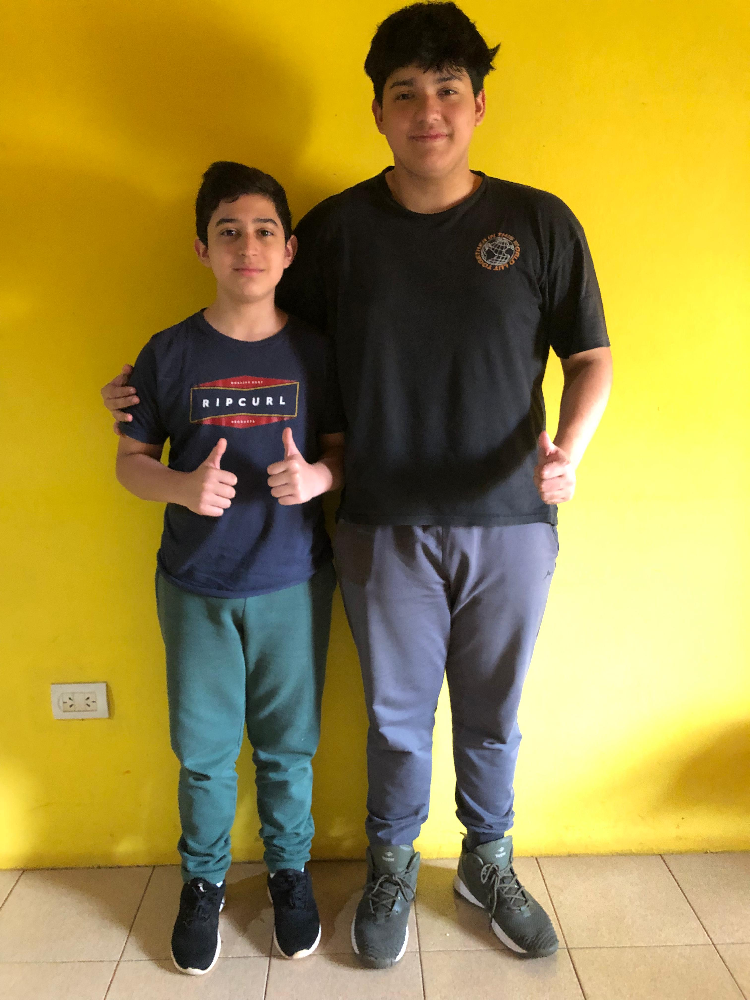

## Introduction
We are a team from Argentina participating in the Future Engineer Category at the World Robot Olympiad (WRO). Our team, XpriT Robotics, is composed of Franco Gallardo and Nahuel Cabaña.
## Index
* [**Contents**](#Contents)
* [**Chassis**](#Chassis)
* [**Power Supply**](#Power_Supply)
* [**Mobility And Direction**](#Mobility_And_Direction)
* [**Electronic Schematics**](#Schematic)
* [**Team Photos**](#Photos)
* [**Demonstration Videos**](#Demonstration_Videos)
## Contents
 * `3D Design` Contains 3D models of the robot in .STL format, ready for 3D printing.
 * `Edge Impulse` Includes obstacle images captured with the ESP32 Cam for training the machine learning model using Edge Impulse.
 * `SRC` Folder with all source codes and electronic schematics of the robot.
 * `Images` Robot photos and logos
 * `Youtube Channel` Videos demonstrating the robot navigating the circuit and avoiding obstacles.

## Chassis
 
 The Chassis of our robot are 3D printed Parts that were designed using SolidWorks and Tinkercad. All 3D models are in [**3D design Folder.**](https://github.com/Gallarfrox/WRO-FE-XPRIT-2024/tree/8289e319c8ed50b18eef6a841f7b57f9364190d7/3D%20Desings)
## Power Supply

The power supply utilized is a 2000mAh 7V Li-Po battery. Additionally, we employ an LM7805 voltage regulator to stabilize the power supplied to our boards and microcontrollers.
## Mobility And Direction

To control direction, we use a Servo attached a 3D printed piece with two wheels in the sides. For Forward and Backwards movement we use a "L" shaped dc Motor.
## Electronic Schematics

Our Electronic Schematics and Codes we use are in [**SRC folder.**](https://github.com/Gallarfrox/WRO-FE-XPRIT-2024/tree/fe686a653da6ce5ed55e57e9bf3dd3e55d9c889c/SRC)
## Team Photos

### Photo:

We have a funny photo in [**Images Folder**](https://github.com/Gallarfrox/WRO-FE-XPRIT-2024/tree/f97b17c5f60459615c8f3205b750cb3410c85aa1/Images)

## Demonstration Videos

Go to [**this youtube channel**](https://youtube.com/@xprit_robotics?si=dhm_ktdyuf9bD-lI) to see demostration videos of the robot working on the circuit